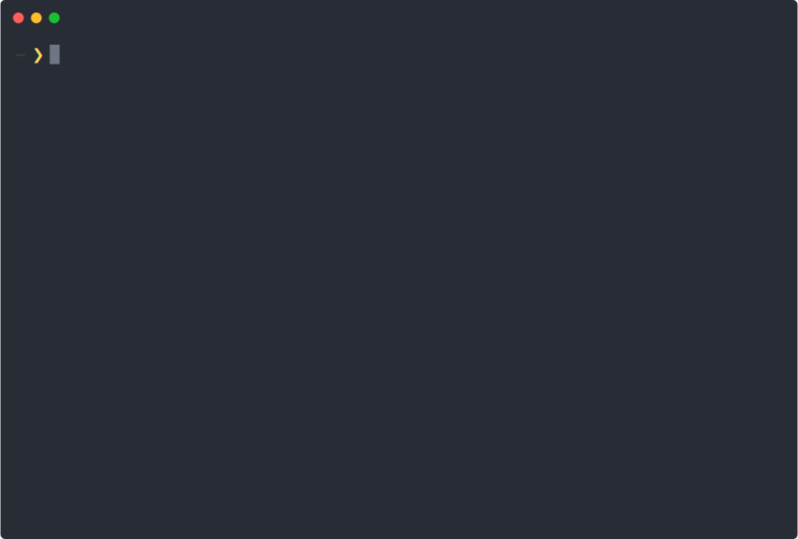

# revive

[](https://github.com/mgechev/revive/actions/workflows/test.yaml)
[](https://pkg.go.dev/github.com/mgechev/revive)
[](https://deepwiki.com/mgechev/revive)

Fast, configurable, extensible, flexible, and beautiful linter for Go. Drop-in replacement of golint.
**`Revive` provides a framework for development of custom rules,
and lets you define a strict preset for enhancing your development & code review processes**.

<p align="center">
  
  <br>
  Logo by <a href="https://github.com/hawkgs">Georgi Serev</a>
</p>

Here's how `revive` is different from `golint`:

- Allows to enable or disable rules using a configuration file.
- Allows to configure the linting rules with a TOML file.
- 2x faster running the same rules as golint.
- Provides functionality for disabling a specific rule or the entire linter for a file or a range of lines.
  - `golint` allows this only for generated files.
- Optional type checking. Most rules in golint do not require type checking.
If you disable them in the config file, revive will run over 6x faster than golint.
- Provides multiple formatters which let us customize the output.
- Allows to customize the return code for the entire linter or based on the failure of only some rules.
- _Everyone can extend it easily with custom rules or formatters._
- `Revive` provides more rules compared to `golint`.

<p align="center">
  
</p>

<!-- toc -->

- [Installation](#installation)
  - [Homebrew](#homebrew)
  - [Install from Sources](#install-from-sources)
  - [Docker](#docker)
  - [Manual Binary Download](#manual-binary-download)
- [Usage](#usage)
  - [Text Editors](#text-editors)
  - [GitHub Actions](#github-actions)
  - [Continuous Integration](#continuous-integration)
  - [Linter aggregators](#linter-aggregators)
    - [golangci-lint](#golangci-lint)
  - [Command Line Flags](#command-line-flags)
  - [Sample Invocations](#sample-invocations)
  - [Comment Directives](#comment-directives)
  - [Configuration](#configuration)
  - [Custom Configuration](#custom-configuration)
  - [Recommended Configuration](#recommended-configuration)
  - [Rule-level file excludes](#rule-level-file-excludes)
- [Available Rules](#available-rules)
- [Available Formatters](#available-formatters)
  - [Friendly](#friendly)
  - [Stylish](#stylish)
  - [Default](#default)
  - [Plain](#plain)
  - [Unix](#unix)
  - [JSON](#json)
  - [NDJSON](#ndjson)
  - [Checkstyle](#checkstyle)
  - [SARIF](#sarif)
- [Extensibility](#extensibility)
  - [Writing a Custom Rule](#writing-a-custom-rule)
    - [Using `revive` as a library](#using-revive-as-a-library)
  - [Custom Formatter](#custom-formatter)
- [Speed Comparison](#speed-comparison)
  - [golint](#golint)
  - [revive's speed](#revives-speed)
- [Overriding colorization detection](#overriding-colorization-detection)
- [Who uses Revive](#who-uses-revive)
- [Contributors](#contributors)
  - [Maintainers](#maintainers)
  - [All](#all)
- [Star History](#star-history)
- [License](#license)

<!-- tocstop -->

## Installation

`revive` is available inside the majority of package managers.

[](https://repology.org/project/revive/versions)

### Homebrew

Install `revive` using [brew](https://brew.sh/):

```bash
brew install revive
```

To upgrade to the latest version:

```bash
brew upgrade revive
```

### Install from Sources

Install the latest stable release directly from source:

```bash
go install github.com/mgechev/revive@latest
```

To install the latest commit from the main branch:

```bash
go install github.com/mgechev/revive@HEAD
```

### Docker

You can run `revive` using Docker to avoid installing it directly on your system:

```bash
docker run -v "$(pwd)":/var/YOUR_REPOSITORY ghcr.io/mgechev/revive:v1.10.0 -config /var/YOUR_REPOSITORY/revive.toml -formatter stylish ./var/YOUR_REPOSITORY/...
```

_Note_: Replace `YOUR_REPOSITORY` with the path to your repository.

A volume must be mounted to share the current repository with the container.
For more details, refer to the [bind mounts Docker documentation](https://docs.docker.com/storage/bind-mounts/).

- `-v`: Mounts the current directory (`$(pwd)`) to `/var/YOUR_REPOSITORY` inside the container.
- `ghcr.io/mgechev/revive:v1.10.0`: Specifies the Docker image and its version.
- `revive`: The command to run inside the container.
- Flags like `-config` and `-formatter` are the same as when using the binary directly.

### Manual Binary Download

Download the precompiled binary from the [Releases page](https://github.com/mgechev/revive/releases):

1. Select the appropriate binary for your OS and architecture.
2. Extract the binary and move it to a directory in your `PATH` (e.g., `/usr/local/bin`).
3. Verify installation:

```bash
revive -version
```

## Usage

Since the default behavior of `revive` is compatible with `golint`, without providing any additional flags,
the only difference you'd notice is faster execution.

`revive` supports a `-config` flag whose value should correspond to a TOML file describing which rules to use for `revive`'s linting.
If not provided, `revive` will try to use a global config file (assumed to be located at `$HOME/revive.toml`).
Otherwise, if no configuration TOML file is found then `revive` uses a built-in set of default linting rules.

### Text Editors

- Support for VSCode via [vscode-go](https://code.visualstudio.com/docs/languages/go#_build-and-diagnose) by changing the `go.lintTool` setting to `revive`:

```json
{
  "go.lintTool": "revive",
}
```

- Support for GoLand via [File Watchers](https://dev.to/s0xzwasd/configure-revive-go-linter-in-goland-2ggl).
- Support for vim via [dense-analysis/ale](https://github.com/dense-analysis/ale).

  ```vim
  let g:ale_linters = {
  \   'go': ['revive'],
  \}
  ```

### GitHub Actions

- [Revive Action](https://github.com/marketplace/actions/revive-action) with annotation support

### Continuous Integration

[Codeac.io](https://www.codeac.io?ref=revive) - Automated code review service integrates with GitHub,
Bitbucket and GitLab (even self-hosted) and helps you fight technical debt.
Check your [pull-requests](https://www.codeac.io/documentation/pull-requests.html?ref=revive) with
[revive](https://www.codeac.io/documentation/revive-configuration.html?ref=revive) automatically.
(Free for open-source projects)

### Linter aggregators

#### golangci-lint

To enable `revive` in `golangci-lint` you need to add `revive` to the list of enabled linters:

```yaml
# golangci-lint configuration file
version: "2"
linters:
   enable:
     - revive
```

Then `revive` can be configured by adding an entry to the `linters.settings` section of the configuration, for example:

```yaml
# golangci-lint configuration file
linters:
  settings:
    revive:
      severity: warning
      rules:
        - name: atomic
        - name: line-length-limit
          severity: error
          arguments: [80]
        - name: unhandled-error
          arguments: ["fmt.Printf", "myFunction"]
```

The above configuration enables three rules of `revive`: _atomic_, _line-length-limit_ and _unhandled-error_ and passes some arguments to the last two.
The [Configuration](#configuration) section of this document provides details on how to configure `revive`.
Note that while `revive` configuration is in TOML, that of `golangci-lint` is in YAML or JSON.
See the [golangci-lint website](https://golangci-lint.run/usage/linters/#revive) for more information about configuring `revive`.

Please notice that if no particular configuration is provided, `revive` will behave as `golint` does, i.e. all `golint` rules are enabled
(the [Available Rules table](#available-rules) details what are the `golint` rules).
When a configuration is provided, only rules in the configuration are enabled.

### Command Line Flags

`revive` accepts the following command line parameters:

- `-config [PATH]` - path to the config file in TOML format, defaults to `$HOME/revive.toml` if present.
- `-exclude [PATTERN]` - pattern for files/directories/packages to be excluded for linting.
You can specify the files you want to exclude for linting either as package name (i.e. `github.com/mgechev/revive`),
list them as individual files (i.e. `file.go`), directories (i.e. `./foo/...`), or any combination of the three.
If no exclusion patterns are specified, `vendor/...` will be excluded by default.
- `-formatter [NAME]` - formatter to be used for the output. The currently available formatters are:

  - `default` - will output the failures the same way that `golint` does.
  - `json` - outputs the failures in JSON format.
  - `ndjson` - outputs the failures as a stream in newline delimited JSON (NDJSON) format.
  - `friendly` - outputs the failures when found. Shows the summary of all the failures.
  - `stylish` - formats the failures in a table. Keep in mind that it doesn't stream the output so it might be perceived as slower compared to others.
  - `checkstyle` - outputs the failures in XML format compatible with that of Java's [Checkstyle](https://checkstyle.org/).
- `-max_open_files` -  maximum number of open files at the same time. Defaults to unlimited.
- `-set_exit_status` - set exit status to 1 if any issues are found, overwrites `errorCode` and `warningCode` in config.
- `-version` - get revive version.

### Sample Invocations

```shell
revive -config revive.toml -exclude file1.go -exclude file2.go -formatter friendly github.com/mgechev/revive package/...
```

- The command above will use the configuration from `revive.toml`
- `revive` will ignore `file1.go` and `file2.go`
- The output will be formatted with the `friendly` formatter
- The linter will analyze `github.com/mgechev/revive` and the files in `package`

### Comment Directives

Using comments, you can disable the linter for the entire file or only a range of lines:

```go
//revive:disable

func Public() {}

//revive:enable
```

The snippet above, will disable `revive` between the `revive:disable` and `revive:enable` comments.
If you skip `revive:enable`, the linter will be disabled for the rest of the file.

With `revive:disable-next-line` and `revive:disable-line` you can disable `revive` on a particular code line.

You can do the same on a rule level. In case you want to disable only a particular rule, you can use:

```go
//revive:disable:unexported-return
func Public() private {
	return private
}

//revive:enable:unexported-return
```

This way, `revive` will not warn you that you're returning an object of an unexported type, from an exported function.

You can document why you disable the linter by adding a trailing text in the directive, for example

```go
//revive:disable Until the code is stable
```

```go
//revive:disable:cyclomatic High complexity score but easy to understand
```

You can also configure `revive` to enforce documenting linter disabling directives by adding

```toml
[directive.specify-disable-reason]
```

in the configuration. You can set the severity (defaults to _warning_) of the violation of this directive

```toml
[directive.specify-disable-reason]
severity = "error"
```

### Configuration

`revive` can be configured with a TOML file. Here's a sample configuration with an explanation of the individual properties:

```toml
# When set to false, ignores files with "GENERATED" header, similar to golint
ignoreGeneratedHeader = true

# Sets the default severity to "warning"
severity = "warning"

# Sets the default failure confidence. This means that linting errors
# with less than 0.8 confidence will be ignored.
confidence = 0.8

# Sets the error code for failures with the "error" severity
errorCode = 0

# Sets the error code for failures with severity "warning"
warningCode = 0

# Configuration of the `cyclomatic` rule. Here we specify that
# the rule should fail if it detects code with higher complexity than 10.
[rule.cyclomatic]
arguments = [10]

# Sets the severity of the `package-comments` rule to "error".
[rule.package-comments]
severity = "error"
```

By default `revive` will enable only the linting rules that are named in the configuration file.
For example, the previous configuration file makes `revive` to enable only _cyclomatic_ and _package-comments_ linting rules.

To enable default rules you need to use:

```toml
enableDefaultRules = true
```

This will enable all rules available in `golint` and use their default configuration (i.e. the way they are hardcoded in `golint`).
The default configuration of `revive` can be found at `defaults.toml`.

To enable all available rules you need to add:

```toml
enableAllRules = true
```

This will enable all available rules no matter what rules are named in the configuration file.

Options `enableAllRules` and `enableDefaultRules` cannot be combined.

To disable a rule, you simply mark it as disabled in the configuration.
For example:

```toml
[rule.line-length-limit]
Disabled = true
```

When enabling all rules you still need/can provide specific configurations for rules.
The following file is an example configuration where all rules are enabled, except for those that are explicitly disabled,
and some rules are configured with particular arguments:

```toml
severity = "warning"
confidence = 0.8
errorCode = 0
warningCode = 0

# Enable all available rules
enableAllRules = true

# Disabled rules
[rule.blank-imports]
Disabled = true
[rule.file-header]
Disabled = true
[rule.max-public-structs]
Disabled = true
[rule.line-length-limit]
Disabled = true
[rule.function-length]
Disabled = true
[rule.banned-characters]
Disabled = true

# Rule tuning
[rule.argument-limit]
Arguments = [5]
[rule.cyclomatic]
Arguments = [10]
[rule.cognitive-complexity]
Arguments = [7]
[rule.function-result-limit]
Arguments = [3]
[rule.error-strings]
Arguments = ["mypackage.Error"]
```

### Custom Configuration

```shell
revive -config config.toml -formatter friendly github.com/mgechev/revive
```

This will use `config.toml`, the `friendly` formatter, and will run linting over the `github.com/mgechev/revive` package.

### Recommended Configuration

The following snippet contains the recommended `revive` configuration that you can use in your project:

```toml
ignoreGeneratedHeader = false
severity = "warning"
confidence = 0.8
errorCode = 0
warningCode = 0

[rule.blank-imports]
[rule.context-as-argument]
[rule.context-keys-type]
[rule.dot-imports]
[rule.error-return]
[rule.error-strings]
[rule.error-naming]
[rule.exported]
[rule.increment-decrement]
[rule.var-naming]
[rule.var-declaration]
[rule.package-comments]
[rule.range]
[rule.receiver-naming]
[rule.time-naming]
[rule.unexported-return]
[rule.indent-error-flow]
[rule.errorf]
[rule.empty-block]
[rule.superfluous-else]
[rule.unused-parameter]
[rule.unreachable-code]
[rule.redefines-builtin-id]
```

### Rule-level file excludes

You also can setup custom excludes for each rule.

It's an alternative for the global `-exclude` program arg.

```toml
ignoreGeneratedHeader = false
severity = "warning"
confidence = 0.8
errorCode = 0
warningCode = 0

[rule.blank-imports]
Exclude = ["**/*.pb.go"]
[rule.context-as-argument]
Exclude = ["src/somepkg/*.go", "TEST"]
```

You can use the following exclude patterns

1. full paths to files `src/pkg/mypkg/some.go`
2. globs `src/**/*.pb.go`
3. regexes (should have prefix ~) `~\.(pb|auto|generated)\.go$`
4. well-known `TEST` (same as `**/*_test.go`)
5. special cases:
  a. `*` and `~` patterns exclude all files (same effect as disabling the rule)
  b. `""` (empty) pattern excludes nothing

> NOTE: do not mess with `exclude` that can  be used at the top level of TOML file, that means "exclude package patterns", not "exclude file patterns"

## Available Rules

See [RULES_DESCRIPTIONS.md](./RULES_DESCRIPTIONS.md#description-of-available-rules) for the list of all available rules and its configuration.

## Available Formatters

This section lists all the available formatters and provides a screenshot for each one.

### Friendly


### Stylish


### Default

The default formatter produces the same output as `golint`.


### Plain

The plain formatter produces the same output as the default formatter and appends the URL to the rule description.


### Unix

The unix formatter produces the same output as the default formatter but surrounds the rules in `[]`.


### JSON

The `json` formatter produces output in JSON format.

### NDJSON

The `ndjson` formatter produces output in [`Newline Delimited JSON`](https://github.com/ndjson/ndjson-spec) format.

### Checkstyle

The `checkstyle` formatter produces output in a [Checkstyle-like](https://checkstyle.sourceforge.io/) format.

### SARIF

The `sarif`  formatter produces output in SARIF, for _Static Analysis Results Interchange Format_,
a standard JSON-based format for the output of static analysis tools defined and promoted by [OASIS](https://www.oasis-open.org/).

Current supported version of the standard is [SARIF-v2.1.0](https://docs.oasis-open.org/sarif/sarif/v2.1.0/csprd01/sarif-v2.1.0-csprd01.html
).

## Extensibility

The tool can be extended with custom rules or formatters. This section contains additional information on how to implement such.

To extend the linter with a custom rule you can push it to this repository or use `revive` as a library (see below)

To add a custom formatter you'll have to push it to this repository or fork it.
This is due to the limited `-buildmode=plugin` support which [works only on Linux (with known issues)](https://pkg.go.dev/plugin).

### Writing a Custom Rule

See [DEVELOPING.md](./DEVELOPING.md) for instructions on how to write a custom rule.

#### Using `revive` as a library

If a rule is specific to your use case
(i.e. it is not a good candidate to be added to `revive`'s rule set) you can add it to your linter using `revive` as a linting engine.

The following code shows how to use `revive` in your application.
In the example only one rule is added (`myRule`), of course, you can add as many as you need to.
Your rules can be configured programmatically or with the standard `revive` configuration file.
The full rule set of `revive` is also actionable by your application.

```go
package main

import (
	"github.com/mgechev/revive/cli"
	"github.com/mgechev/revive/lint"
	"github.com/mgechev/revive/revivelib"
)

func main() {
	cli.RunRevive(revivelib.NewExtraRule(&myRule{}, lint.RuleConfig{}))
}

type myRule struct{}

func (f myRule) Name() string {
	return "myRule"
}

func (f myRule) Apply(*lint.File, lint.Arguments) []lint.Failure {
	// ...
}
```

You can still go further and use `revive` without its CLI, as part of your library, or your CLI:

```go
package mylib

import (
	"github.com/mgechev/revive/config"
	"github.com/mgechev/revive/lint"
	"github.com/mgechev/revive/revivelib"
)

// Error checking removed for clarity
func LintMyFile(file string) {
	conf, _ := config.GetConfig("../defaults.toml")

	revive, _ := revivelib.New(
		conf, // Configuration file
		true, // Set exit status
		2048, // Max open files

		// Then add as many extra rules as you need
		revivelib.NewExtraRule(&myRule{}, lint.RuleConfig{}),
	)

	failuresChan, err := revive.Lint(
		revivelib.Include(file),
		revivelib.Exclude("./fixtures"),
		// You can use as many revivelib.Include or revivelib.Exclude as required
	)
	if err != nil {
		panic("Shouldn't have failed: " + err.Error())
	}

	// Now let's return the formatted errors
	failures, exitCode, _ := revive.Format("stylish", failuresChan)

	// failures is the string with all formatted lint error messages
	// exit code is 0 if no errors, 1 if errors (unless config options change it)
	// ... do something with them
}

type myRule struct{}

func (f myRule) Name() string {
	return "myRule"
}

func (f myRule) Apply(*lint.File, lint.Arguments) []lint.Failure {
	// ...
}
```

### Custom Formatter

Each formatter needs to implement the following interface:

```go
type Formatter interface {
	Format(<-chan Failure, Config) (string, error)
	Name() string
}
```

The `Format` method accepts a channel of `Failure` instances and the configuration of the enabled rules.
The `Name()` method should return a string different from the names of the already existing rules.
This string is used when specifying the formatter when invoking the `revive` CLI tool.

For a sample formatter, take a look at [this file](/formatter/json.go).

## Speed Comparison

Compared to `golint`, `revive` performs better because it lints the files for each individual rule into a separate goroutine.
Here's a basic performance benchmark on MacBook Pro Early 2013 run on Kubernetes:

### golint

```shellsession
$ time golint kubernetes/... > /dev/null

real    0m54.837s
user    0m57.844s
sys     0m9.146s
```

### revive's speed

```shellsession
# no type checking
$ time revive -config untyped.toml kubernetes/... > /dev/null

real    0m8.471s
user    0m40.721s
sys     0m3.262s
```

Keep in mind that if you use rules that require type checking, the performance may drop to 2x faster than `golint`:

```shellsession
# type checking enabled
$ time revive kubernetes/... > /dev/null

real    0m26.211s
user    2m6.708s
sys     0m17.192s
```

Currently, type-checking is enabled by default. If you want to run the linter without type-checking, remove all typed rules from the configuration file.

## Overriding colorization detection

By default, `revive` determines whether or not to colorize its output based on whether it's connected to a TTY or not.
This works for most use cases, but may not behave as expected if you use `revive` in a pipeline of commands,
where STDOUT is being piped to another command.

To force colorization, add `REVIVE_FORCE_COLOR=1` to the environment you're running in. For example:

```shell
REVIVE_FORCE_COLOR=1 revive -formatter friendly ./... | tee revive.log
```

## Who uses Revive

<!-- markdownlint-disable MD013 -->

- [`tidb`](https://github.com/pingcap/tidb) - TiDB is a distributed HTAP database compatible with the MySQL protocol
- [`grafana`](https://github.com/grafana/grafana) - The tool for beautiful monitoring and metric analytics & dashboards for Graphite, InfluxDB & Prometheus & More
- [`etcd`](https://github.com/etcd-io/etcd) - Distributed reliable key-value store for the most critical data of a distributed system
- [`cadence`](https://github.com/uber/cadence) - Cadence is a distributed, scalable, durable, and highly available orchestration engine by Uber to execute asynchronous long-running business logic in a scalable and resilient way
- [`ferret`](https://github.com/MontFerret/ferret) - Declarative web scraping
- [`gopass`](https://github.com/gopasspw/gopass) - The slightly more awesome standard unix password manager for teams
- [`gitea`](https://github.com/go-gitea/gitea) - Git with a cup of tea, painless self-hosted git service
- [`excelize`](https://github.com/360EntSecGroup-Skylar/excelize) - Go library for reading and writing Microsoft Excel™ (XLSX) files
- [`aurora`](https://github.com/xuri/aurora) - aurora is a web-based Beanstalk queue server console written in Go
- [`soar`](https://github.com/XiaoMi/soar) - SQL Optimizer And Rewriter
- [`pyroscope`](https://github.com/pyroscope-io/pyroscope) - Continuous profiling platform
- [`gorush`](https://github.com/appleboy/gorush) - A push notification server written in Go (Golang).
- [`dry`](https://github.com/moncho/dry) - dry - A Docker manager for the terminal.
- [`go-echarts`](https://github.com/chenjiandongx/go-echarts) - The adorable charts library for Golang
- [`reviewdog`](https://github.com/reviewdog/reviewdog) - Automated code review tool integrated with any code analysis tools regardless of programming language
- [`rudder-server`](https://github.com/rudderlabs/rudder-server) - Privacy and Security focused Segment-alternative, in Golang and React.
- [`sklearn`](https://github.com/pa-m/sklearn) - A partial port of scikit-learn written in Go.
- [`protoc-gen-doc`](https://github.com/pseudomuto/protoc-gen-doc) - Documentation generator plugin for Google Protocol Buffers.
- [`llvm`](https://github.com/llir/llvm) - Library for interacting with LLVM IR in pure Go.
- [`jenkins-library`](https://github.com/SAP/jenkins-library) - Jenkins shared library for Continuous Delivery pipelines by SAP.
- [`pd`](https://github.com/tikv/pd) - Placement driver for TiKV.
- [`shellhub`](https://github.com/shellhub-io/shellhub) - ShellHub enables teams to easily access any Linux device behind firewall and NAT.
- [`lorawan-stack`](https://github.com/TheThingsNetwork/lorawan-stack) - The Things Network Stack for LoRaWAN V3
- [`gin-jwt`](https://github.com/appleboy/gin-jwt) - This is a JWT middleware for Gin framework.
- [`gofight`](https://github.com/appleboy/gofight) - Testing API Handler written in Golang.
- [`Beaver`](https://github.com/Clivern/Beaver) - A Real Time Messaging Server.
- [`ggz`](https://github.com/go-ggz/ggz) - An URL shortener service written in Golang
- [`Codeac.io`](https://www.codeac.io?ref=revive) - Automated code review service integrates with GitHub, Bitbucket and GitLab (even self-hosted) and helps you fight technical debt.
- [`DevLake`](https://github.com/apache/incubator-devlake) - Apache DevLake is an open-source dev data platform to ingest, analyze, and visualize the fragmented data from DevOps tools，which can distill insights to improve engineering productivity.
- [`checker`](https://github.com/cinar/checker) - Checker helps validating user input through rules defined in struct tags or directly through functions.
- [`milvus`](https://github.com/milvus-io/milvus) - A cloud-native vector database, storage for next generation AI applications.
- [`indicator`](https://github.com/cinar/indicator) - Indicator provides various technical analysis indicators, strategies, and a backtesting framework.

<!-- markdownlint-enable MD013 -->

_Open a PR to add your project_.

## Contributors

### Maintainers

| [](https://github.com/mgechev) | [](https://github.com/chavacava) | [](https://github.com/denisvmedia) | [](https://github.com/alexandear) |
|---|---|---|---|
| [mgechev](https://github.com/mgechev) | [chavacava](https://github.com/chavacava) | [denisvmedia](https://github.com/denisvmedia) | [alexandear](https://github.com/alexandear) |

### All

This project exists thanks to all the people who contribute.

<a href="https://github.com/mgechev/revive/graphs/contributors">
  
</a>

## Star History

<a href="https://www.star-history.com/#mgechev/revive&type=date&legend=top-left">
 <picture>
   <source media="(prefers-color-scheme: dark)" srcset="https://api.star-history.com/svg?repos=mgechev/revive&type=date&theme=dark&legend=top-left" />
   <source media="(prefers-color-scheme: light)" srcset="https://api.star-history.com/svg?repos=mgechev/revive&type=date&legend=top-left" />
   
 </picture>
</a>

## License

MIT
